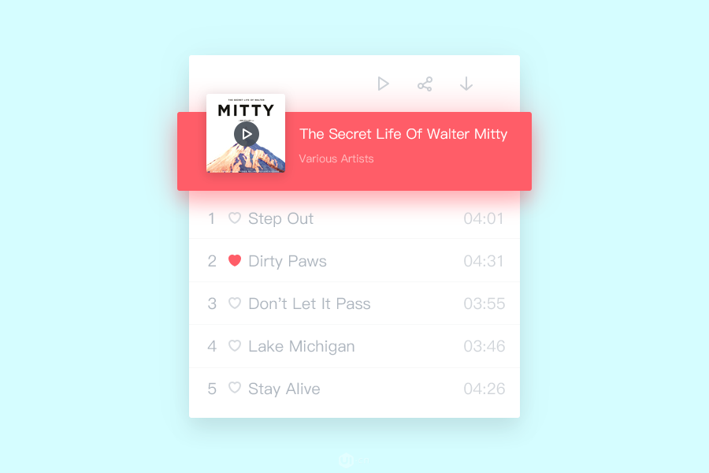
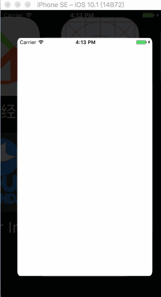

# SimpleMusicPlayer
A Beautiful&amp;Simple Music Player~

      If you want to use the music in it, please buy a license from Epidemic Sound or iTunes Store!

The library using for getting audio file's info is:[HERE](https://github.com/Dendim0n/EZAudioFileInfo)

The `twitter heart animation button` is translate from Obj-C version of [HERE](https://github.com/StoryOfMyLife/TTAnimationButton)

And you can get the swift version of button from `/Player/twitterButton.swift`

The UITableView's Load&Reloading Animation is from [HERE](https://github.com/Dendim0n/UITableViewAnimation)

UI Inspired by : (But I don't know who designed it..Please let me know,thanks!)

Demo:

